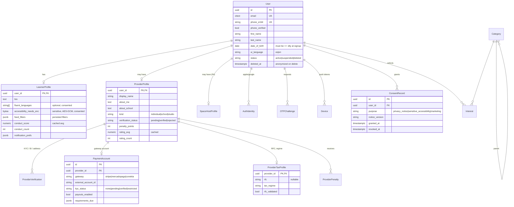
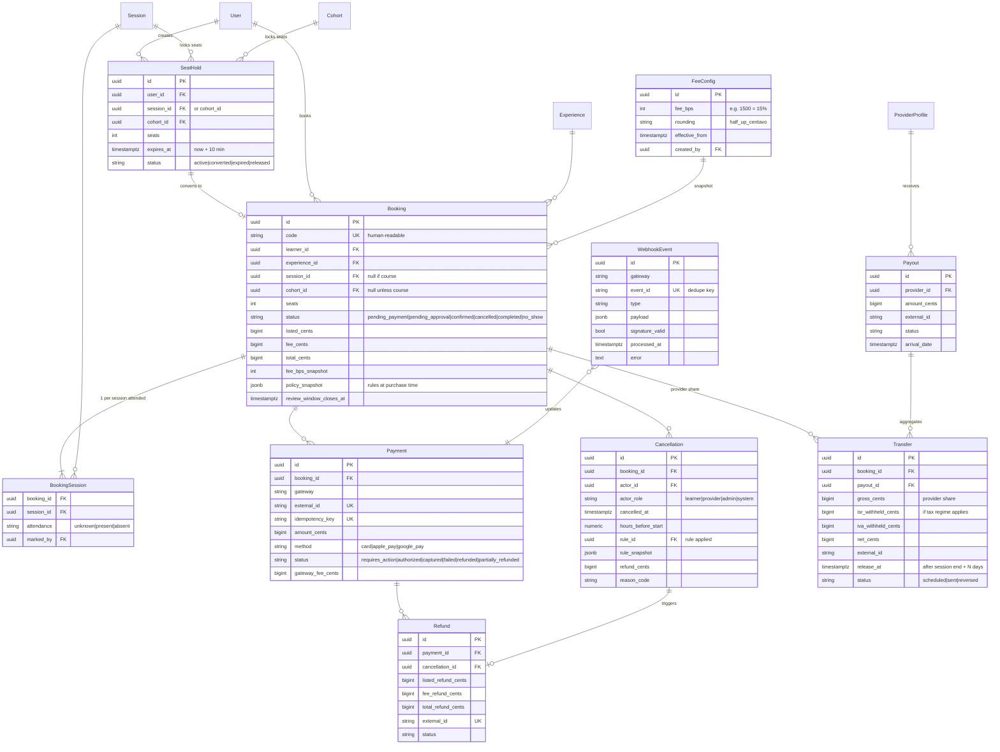
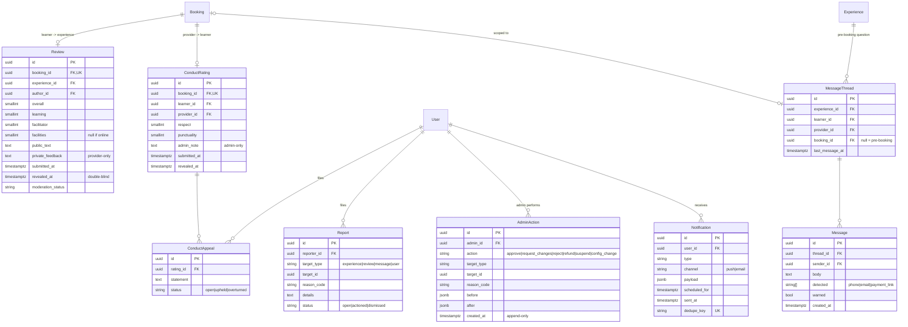

# 01 — Data model (ERD)

Conventions used everywhere:

- **Money**: integer centavos (`*_cents`, `BIGINT`), currency `MXN`. Never floats.
- **Time**: `timestamptz` in UTC; display in `America/Mexico_City`.
- **IDs**: UUIDv7 primary keys (sortable, not enumerable in URLs).
- **Soft delete** only where legally required (users, reviews); everything else is append-only or status-driven.
- **Snapshots**: anything that determines money (fee %, cancellation rules, price) is copied onto the booking at purchase time, so later config changes never rewrite history.
- `(P4)` = table exists in the design now, created in Phase 4. No existing table changes in Phase 4.

## 1. Diagram

Split into four domains for readability. Mermaid renders on GitHub.

### 1.1 Identity, profiles, consent

### 1.2 Catalog: experiences, spaces, sessions, policies

```mermaid
erDiagram
    ProviderProfile ||--o{ Experience : publishes
    User ||--o{ Space : owns
    Space ||--o{ Experience : "default venue"
    Space ||--o{ Session : hosts
    Space ||--o{ SpaceMedia : ""
    Category ||--o{ Experience : classifies
    CancellationPolicy ||--o{ CancellationRule : "rows = config"
    CancellationPolicy ||--o{ Experience : "assigned to"
    Experience ||--o{ ExperienceRevision : "edits under review"
    Experience ||--o{ ExperienceMedia : ""
    Experience ||--o{ Cohort : "course runs"
    Experience ||--o{ Session : ""
    Cohort ||--o{ Session : groups
    MediaAsset ||--o{ ExperienceMedia : ""
    MediaAsset ||--o{ SpaceMedia : ""
    Space ||--o{ SpaceAvailability : "rentable slots (P4)"
    SpaceAvailability ||--o{ SpaceRental : "(P4)"
    ProviderProfile ||--o{ SpaceRental : "rents (P4)"

    Space {
        uuid id PK
        uuid owner_user_id FK "provider now, space host later"
        string owner_role "provider|space_host"
        string name
        text about
        text address_line_enc "revealed after booking"
        string neighborhood
        string city
        geography point_exact "SRID 4326, private"
        geography point_public "stable ~400m offset, GiST"
        string verification_status
        bool is_rentable "false until P4"
    }
    Experience {
        uuid id PK
        uuid provider_id FK
        uuid category_id FK
        uuid space_id FK "null if online"
        uuid cancellation_policy_id FK
        string status "draft|in_review|changes_requested|live|paused|expired|rejected"
        string title
        text what_you_learn
        text who_its_for
        string instruction_language
        string modality "in_person|online"
        string offering_type "single|course|dropin"
        bigint listed_price_cents "per seat; per course if course"
        int default_capacity
        text online_url_enc "revealed after booking"
        timestamptz publish_until "null = indefinite"
        string requires_approval_below "nullable conduct threshold"
        timestamptz next_session_at "denormalized for feed"
        geography point_public "denormalized from space, GiST"
        int live_revision
    }
    ExperienceRevision {
        uuid id PK
        uuid experience_id FK
        int number
        jsonb payload "full proposed content"
        bool is_material "re-enters review"
        string review_status "pending|approved|changes_requested|rejected"
        string reason_code
    }
    Cohort {
        uuid id PK
        uuid experience_id FK
        string label
        int capacity
        int seats_booked
    }
    Session {
        uuid id PK
        uuid experience_id FK
        uuid cohort_id FK "null unless course"
        uuid space_id FK "nullable"
        timestamptz starts_at
        timestamptz ends_at
        smallint local_dow "generated, for filters"
        time local_start_time "generated, for filters"
        int capacity
        int seats_booked
        string status "scheduled|cancelled|completed"
    }
    CancellationPolicy {
        uuid id PK
        string code UK "standard|flexible|firm"
        jsonb name_i18n
        bool is_active
    }
    CancellationRule {
        uuid id PK
        uuid policy_id FK
        int min_hours_before "inclusive"
        int max_hours_before "exclusive, null=inf"
        smallint listed_refund_pct "0-100"
        bool refund_fee
        string applies_to "learner_cancel|no_show"
    }
    MediaAsset {
        uuid id PK
        uuid owner_user_id FK
        string kind "image|video"
        string storage_key
        string status "uploaded|processing|ready|rejected"
        jsonb variants "sizes, poster, durations"
    }
    SpaceAvailability {
        uuid id PK
        uuid space_id FK
        tstzrange slot
        bigint price_cents
    }
    SpaceRental {
        uuid id PK
        uuid availability_id FK
        uuid provider_id FK
        string status
    }
```

### 1.3 Booking, payments, money movement

### 1.4 Trust & safety: reviews, conduct, messaging, moderation

## 2. Design decisions embedded in the model (please review)

| # | Decision | Why | Alternative |
|---|---|---|---|
| D1 | `Space.owner_user_id` points to **User**, with `owner_role`, not to `ProviderProfile`. | Phase 4 Space Hosts own spaces without any migration on `Space`. Phase 4 only *adds* `SpaceHostProfile`, `SpaceAvailability`, `SpaceRental`. | FK to a polymorphic "Party" table. More abstract, no real benefit. |
| D2 | `Session.space_id` exists (nullable). | "Display experiences running in each space" (P4) becomes a plain join. A provider can also run sessions in different spaces. | Only `Experience.space_id`. Breaks if a course moves venue. |
| D3 | Seat inventory is a counter (`seats_booked`) on `Session`/`Cohort`, plus live `SeatHold` rows. Availability = `capacity − seats_booked − Σ active holds`. All writes do `SELECT … FOR UPDATE` on the session row(s), locked in ascending id order so course bookings (many sessions) can't deadlock. | Counter keeps feed reads cheap; holds stay auditable. | Pure counting of bookings: slower, harder to lock. |
| D4 | Courses use `Cohort`. A course booking takes a seat in **every** session of the cohort. | Matches "multi-session course" as one purchase. | Needs your confirmation (Q-B1). |
| D5 | `CancellationPolicy` + `CancellationRule` rows. New tiers = new rows via admin. | Satisfies "config only, no schema change". The booking stores `policy_snapshot`, so editing a policy never changes old bookings. | JSON rules blob: also config-only but harder to validate in admin. |
| D6 | Fee stored as basis points with an explicit rounding rule, snapshotted on `Booking`. | Deterministic fee math, testable. | — |
| D7 | Material edits create an `ExperienceRevision`; the live version stays live until the revision is approved. | Providers don't lose bookings or visibility while a typo fix is reviewed. | Pull listing offline on every edit. Simpler, worse for providers. |
| D8 | Public location = a stable offset point (~400 m), computed once. Distance sort and filters use the **public** point. | Re-randomizing or sorting by the exact point lets a user triangulate the address. | Neighborhood centroid only. |
| D9 | `Transfer` (provider share per booking) is separate from `Payout` (bank deposit), with `release_at` after the session ends and ISR/IVA withholding columns. | Lets us hold funds until the class happens (refunds stay cheap) and supports Mexico's platform tax withholding if it applies (see open question Q-T1). | Pay provider at booking time. Makes refunds depend on provider balance. |
| D10 | `WebhookEvent.event_id` unique + processed flag. | Idempotent webhooks: duplicate deliveries are no-ops. | — |
| D11 | `accessibility_needs_enc` and address/online link encrypted at the application layer (AES-GCM, key from env, key id prefix for rotation). | LFPDPPP sensitive data; minimizes exposure in DB dumps and admin. | Postgres `pgcrypto`. Keys would travel in SQL. |
| D12 | `AdminAction` is append-only (no update/delete permission at DB role level). | Audit log integrity. | — |

## 3. Indexes that matter for the p95 < 300 ms feed

- `Experience(point_public)` GiST (geography) → `ST_DWithin` radius filter.
- `Experience(status, next_session_at)` partial index `WHERE status = 'live'`.
- `Session(experience_id, starts_at)`, plus `(local_dow, local_start_time)` for the day/time filter.
- `Experience(category_id)`, `Experience(instruction_language)`, `Experience(modality)`.
- Trigram (`pg_trgm`) GIN on title for the search bar. Built into Postgres, no extra dependency.
- `next_session_at`, `seats_available_next` and `min_total_cents` are denormalized onto `Experience` and refreshed on booking/session change, so the feed query never aggregates over sessions.
