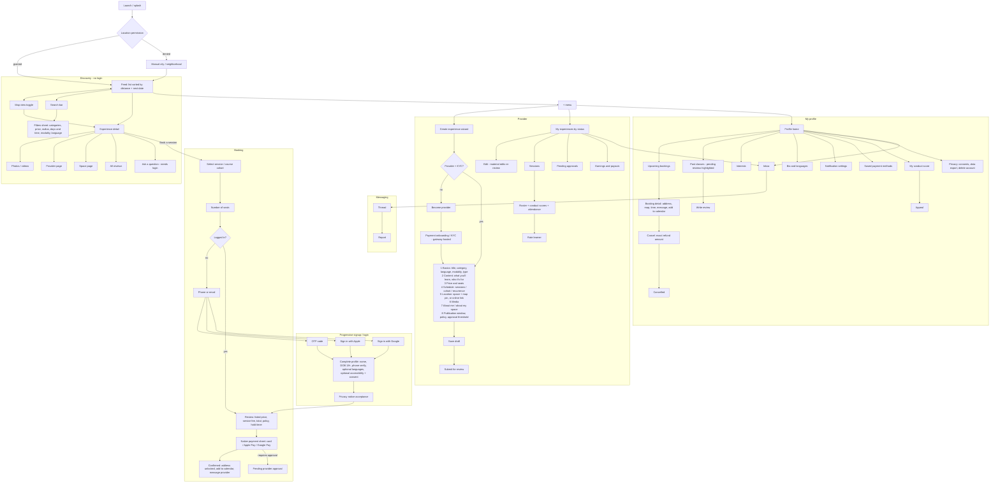
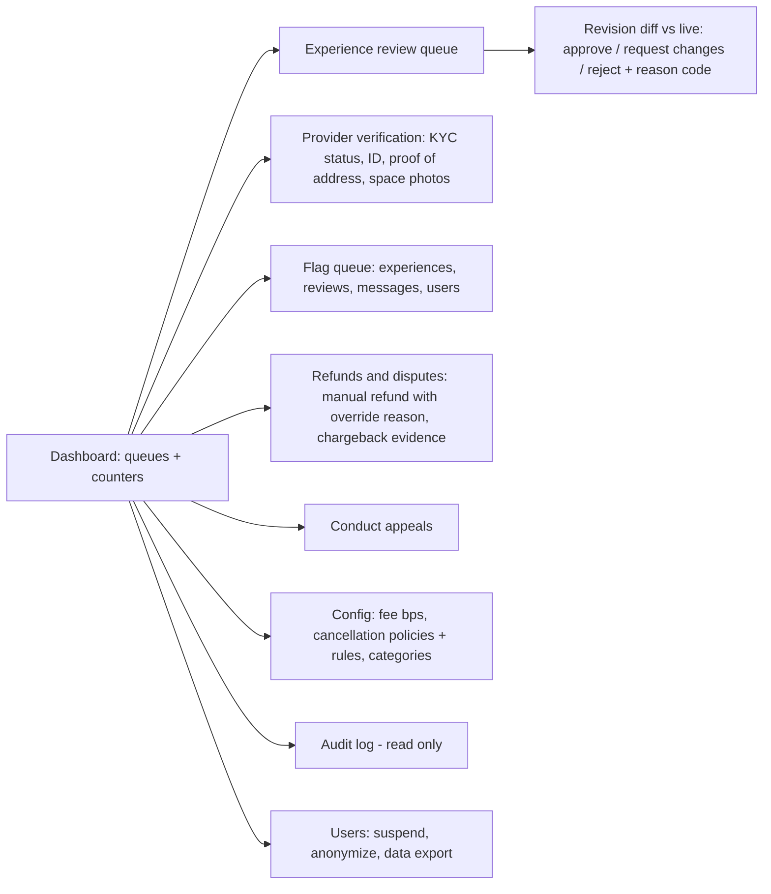

# 03 — Screen map

## 1. Mobile app (React Native + Expo)

### Navigation shell

Per the brief, the first screen is the feed and the only global entry is the top-right "+" menu. Proposed: **no bottom tab bar** in MVP, with Inbox and Bookings reachable from "My profile". Open decision O-UX1: a 3-tab bar (Explore, Bookings, Inbox) usually raises retention for booking apps; I'd recommend it, your call.

### Screen count (MVP, Phases 1–3)

| Area | Screens |
|---|---|
| Discovery | 7 |
| Auth / signup | 5 |
| Checkout | 5 |
| Learner profile | 12 |
| Messaging | 3 |
| Provider | ~14 (wizard counted as 1 with 8 steps) |
| **Total** | **~46** |

## 2. Admin (extended Django admin, web)

Every write action in admin goes through a service function that records an `AdminAction`, so the audit log can't be bypassed by editing a model form directly.
