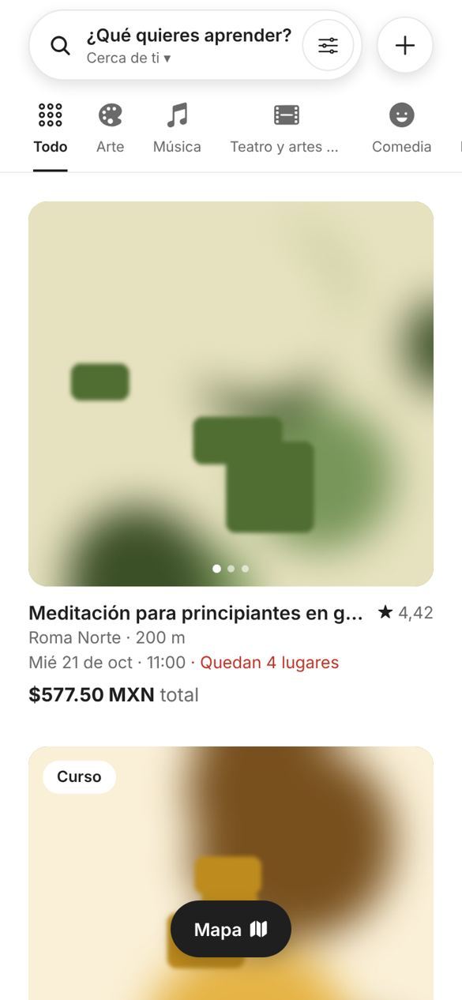
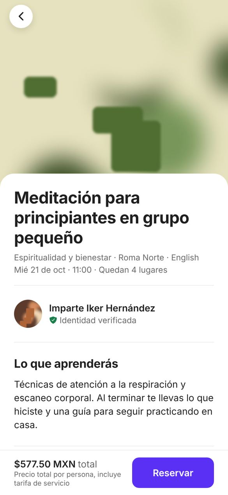
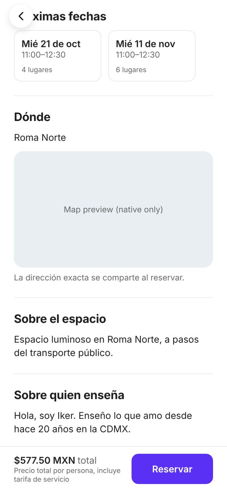
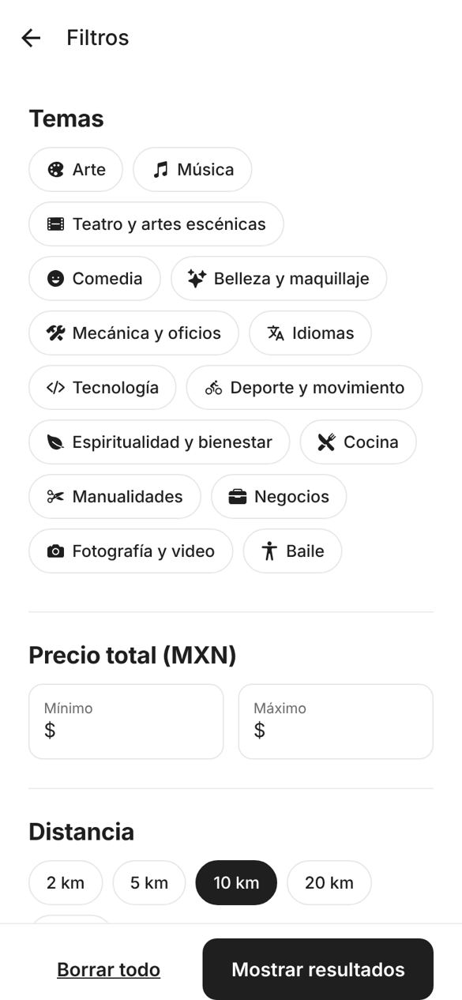
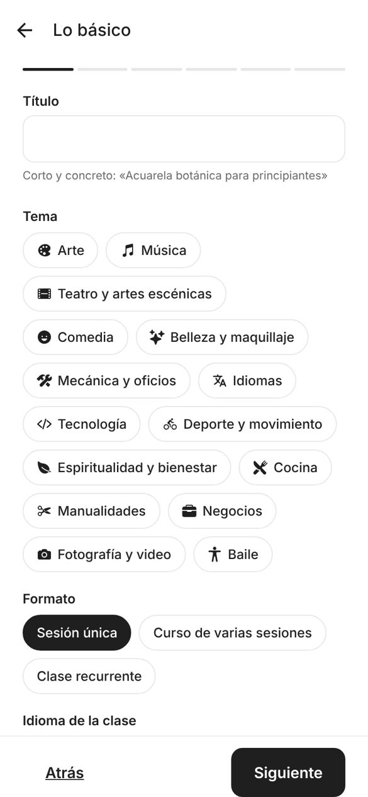
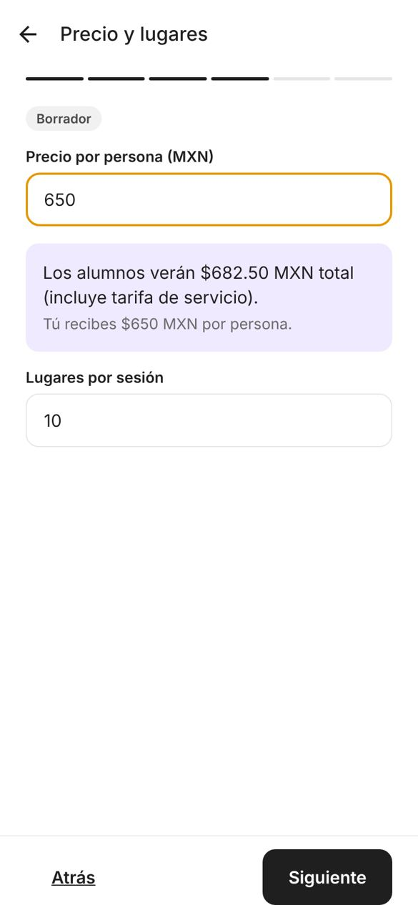
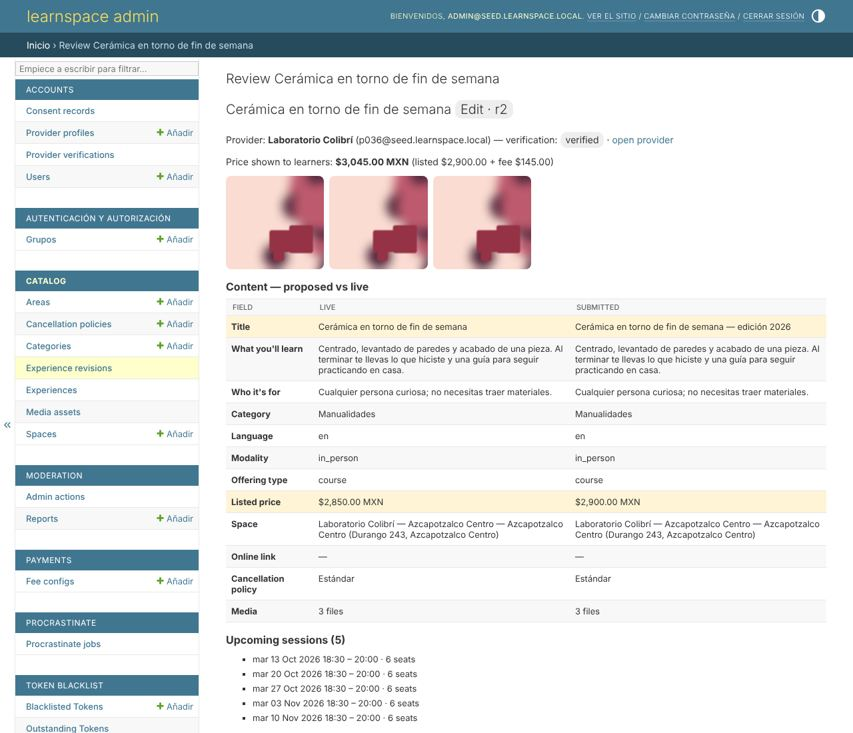

# Phase 1 — Auth, discovery, provider creation, admin review

Status: **built, tested, awaiting your approval.** Booking and payments are Phase 2; the "Reservar" button currently explains that bookings open soon.

## 1. Your Phase 0 answers, as applied

| Decision | Applied as |
|---|---|
| Brand | `learnspace` everywhere (bundle id `com.learnspace.app`, env `BRAND_NAME`). Change = env + `app.json`. |
| Legal entity / RFC | Placeholders `LEGAL_ENTITY_NAME=RAZON SOCIAL PENDIENTE`, `LEGAL_RFC=RFC_PENDIENTE`, shown on the privacy-consent step and `/config`. |
| Fee | **5%** (`FeeConfig.fee_bps = 500`), treated as IVA-included. Configurable in admin; rows are immutable, a change is a new row with an effective date. **See §4: at 5% the platform loses money per booking.** |
| Payments | Stripe Connect (Phase 2). Nothing payment-related was built yet. |
| OTP channel | SMS behind a 20-line `SMSBackend` interface (console backend in dev). Email OTP also works. |
| Age | Self-declared DOB, 18+ enforced server-side in `America/Mexico_City` date (leap-day births handled). No minors; one account = one adult. |
| Provider verification | Government ID upload (INE/passport) reviewed by admin. An experience can't be approved until the provider's ID is verified. |
| Courses | `Cohort` = one purchase for all its sessions; no joining after session 1 (enforced when booking ships in Phase 2). |
| Categories | Flat list of 15, loaded by migration, editable in admin. |
| Media limits | 10 photos, 3 videos ≤ 60 s, ≤ 15 MB per image, ≤ 100 MB per video upload. |
| Hosting | < USD 50/month with a hard cap: see §5. Nothing deployed yet. |
| Design | "Show, don't tell": photo-first cards with swipeable galleries, full-bleed detail hero, quiet chrome, one accent color. See §3. |

## 2. What was built

**Backend** (`backend/`, Django 5.2 + DRF, PostgreSQL 16 + PostGIS 3.4)

- **Auth:** phone or email OTP (6 digits, HMAC-hashed, 10-min TTL, 5 attempts then locked, 3 codes per destination per 10 min, per-IP throttles), Apple and Google ID-token verification against their JWKS (audience, issuer, expiry, Apple nonce), JWT access (15 min) + rotating refresh (30 d) with blacklist on rotation and logout.
- **Progressive profile:** name, email, verified phone, DOB (18+), privacy-notice consent (versioned record). Optional languages and accessibility needs, each requiring its own explicit consent; accessibility needs are AES-256-GCM encrypted at rest and deleted when consent is revoked.
- **Discovery feed:** PostGIS radius search, distance or soonest sort, categories, **total-price** range (listed + fee computed in SQL with the same integer rounding as checkout), ISO weekday + time window ("session fits inside Tue 19:00–21:00"), language, text search (trigram index). Manual neighborhood fallback (31 seeded CDMX areas). Map endpoint with bounding box.
- **Location privacy:** each space has a stable public point 150–450 m from the real one; feed distances, map pins and the detail map use only that point. The exact address is encrypted and returned only to the owner (Phase 2 adds booked learners).
- **Provider tools:** become a provider, ID upload, spaces with map pin, experiences (draft → in review → live / changes requested / rejected, pause/resume, expiry), single/drop-in sessions with weekly recurrence, course cohorts, media upload via presigned URLs.
- **Live edits don't unpublish:** material changes to a live experience accumulate in a revision that admin reviews; the live version keeps selling. Non-material fields (capacity, publication window) apply directly.
- **Media pipeline (Postgres job queue, no Redis):** images get EXIF orientation applied, all metadata stripped (removes GPS), 400/800/1600 px JPEG variants and a dominant color for loading placeholders; videos get duration/size limits, ≤720p H.264 transcode with faststart and a poster frame. Reads use signed, expiring URLs.
- **Admin (extended Django admin):** review queue defaulting to pending items, with live-vs-proposed diff, learner-facing price, media and sessions; approve / request changes / reject with reason codes and a required note. Provider ID queue with document viewing (every view is audited). Fee config, cancellation policies (rule validation: no gaps/overlaps, one no-show rule), categories. **Append-only audit log enforced by a database trigger.** Decision emails go to the provider in their language.
- **Cancellation policy as data:** "Standard" loaded by migration exactly as specified; new tiers are rows, no schema change.
- **Ops:** env-only config, JSON structured logs with request IDs, optional Sentry, Dockerfile + compose, health check, `seed_cdmx`, `bench_feed`.

**Mobile** (`mobile/`, Expo SDK 57, TypeScript, expo-router)

Feed with category strip, search pill with filter button, "+" menu, list/map toggle; filters sheet (persisted on device for guests, to the profile when logged in); location permission with neighborhood fallback; experience detail; OTP / Apple / Google sign-in; profile completion with consent; profile and interests; become-a-provider with ID upload; six-step creation wizard (saves on every step, live price preview); session scheduling (single, weekly recurrence, course cohort); new space with map pin; manage experiences with status badges, reviewer notes and pause/resume. Spanish default, English complete.

## 3. Screens

Real renders of the app (web preview at phone size, against the seeded API). Photos are **generated stand-ins**: the sandbox cannot reach any photo host, so the seed's picsum URLs were intercepted. On a device, seed photos load from picsum; real listings use provider uploads.

| Feed | Detail | Detail (dates, approx. location) |
|---|---|---|
|  |  |  |

| Filters | "+" menu | Sign in |
|---|---|---|
|  |  |  |

| Wizard: basics | Wizard: price preview | Manage experiences |
|---|---|---|
|  |  |  |

Admin review queue (edit of a live experience; changed fields highlighted):

Map views show a placeholder in the web preview; on iOS/Android they render Apple Maps / Google Maps.

## 4. Fee and taxes: your question, and a problem with 5%

### "Provider receives 100% after taxes?" — how it's normally done in Mexico

Mexico has a specific regime for digital platforms that intermediate goods and services between third parties (LISR Art. 113-A, LIVA Art. 18-J; Uber, Airbnb, Rappi and Mercado Libre operate under it). As I understand it:

1. For **individual providers (personas físicas)**, the platform **must withhold ISR and IVA** from each payment and pay it to SAT monthly, and give the provider a CFDI of withholdings. The withholding counts toward the provider's own taxes; it is not platform revenue.
2. Withholding is **much higher when the provider gives no RFC** (in the order of 20% ISR and 100% of the IVA) than with RFC (low single-digit ISR and half the IVA). Rates were touched by recent reforms, so **confirm current numbers with a tax advisor**.
3. Providers that are **companies (personas morales)**, e.g. registered schools, are generally not withheld by the platform; they invoice on their own.
4. Many non-accredited classes (workshops, hobby courses) are **subject to IVA**. Courses from schools with RVOE are typically exempt. So the "listed price" is best defined as **IVA included**.

**Standard wording:** "Sin comisión para quien enseña: recibes el 100% de tu precio publicado, menos las retenciones de impuestos que exige la ley." The earnings screen shows: listed price → ISR withheld → IVA withheld → deposit. The data model already has `isr_withheld_cents` / `iva_withheld_cents` on `Transfer` (Phase 0 ERD). **Requiring an RFC from individual providers at onboarding** is strongly advisable: without one, they lose ~a third of the payment to withholding and will churn.

This needs a tax advisor before Phase 2 ships money. It does not block building Phase 2.

### 5% does not cover payment processing

With the platform absorbing Stripe's cost (3.6% + MXN 3, plus 16% IVA on it), and the 5% fee IVA-included:

| Listed price | Fee 5% | Fee net of IVA | Stripe cost | **Platform net per booking** |
|---|---|---|---|---|
| MXN 200 | 10.00 | 8.62 | 12.25 | **−3.63** |
| MXN 500 | 25.00 | 21.55 | 25.40 | **−3.85** |
| MXN 1,000 | 50.00 | 43.10 | 47.33 | **−4.23** |

That's before Stripe Connect's per-account and per-payout fees (~MXN 13–22 per booking at low volume) and SMS costs. Break-even on processing alone is roughly **5.5% (MXN 1,000 class) to 7.2% (MXN 200 class)**. Options:

1. **Raise the learner fee to 10–12%.** Covers processing and leaves 4–6 points of margin. Airbnb's guest fee is typically up to ~14%.
2. **5% + a minimum fee** (e.g. `max(5%, MXN 15)`). Protects cheap classes; still loses money on expensive ones.
3. **Split fee:** 5% learner + 3–5% provider commission. Breaks "100% to the provider".
4. **Keep 5% as a launch subsidy** for a fixed period, budgeted as customer-acquisition cost.

The fee is configurable today, so this doesn't block Phase 2. It is a launch decision. Mine: **option 1 at 10%**, still below Airbnb's guest fee.

## 5. Hosting under USD 50/month with a hard cap

Nothing is deployed yet. The stack is one web container, one worker container and Postgres with PostGIS, all small. Prices below are from memory and need checking at signup:

- **Railway:** usage-based with a configurable **hard usage limit** that stops services when reached. That matches "hard cap". Postgres with PostGIS via its template image.
- **Render:** fixed price per instance (web + worker + Postgres ≈ USD 20–30). Predictable, but no automatic hard stop; bandwidth overage is billed.
- **Outside the host:** Cloudflare R2 for media (free tier 10 GB, no egress fees), Sentry free tier, Amazon SES for email (cents). **SMS is the cost that scales with signups**, roughly USD 0.03–0.08 per OTP in Mexico depending on vendor; confirm with Twilio/Bird quotes.

Recommendation: **Railway with the hard limit set to USD 45**, and a USD 5 cap on the SMS vendor account. I'll set it up when you want a staging environment.

## 6. Verification

| Check | Result |
|---|---|
| Backend tests (pytest, real PostGIS) | **112 passed**: price math (incl. SQL-vs-Python total parity over 84 price/fee combinations), 18+ gate (boundary and leap-day), OTP lifecycle and rate limits, Apple/Google token validation (signature, audience, nonce, expiry, no account takeover via unverified email), consent and encryption at rest, feed filters and ordering, location privacy, revision workflow, admin UI decisions, audit-log immutability, policy validation, image/video pipelines |
| Mobile tests (jest) | 13 passed (price/distance/date formatting, filter serialization and sanitizing) |
| Lint / types | ruff clean; `tsc --noEmit` clean; ESLint 0 errors |
| Bundles | iOS and Android Metro bundles build (`expo export`) |
| Feed latency | 200 experiences: p95 **25 ms**. 5,200 experiences: p95 **36 ms** (target < 300 ms). Measured through the full Django stack on this container, without network. |
| End to end | In a browser: guest feed → filters → detail → "+" → create experience → SMS OTP login (code read from server log) → wizard steps → draft saved → listed in "Mis experiencias". The per-phone OTP limit triggered correctly on a 4th rapid attempt. |

Not verified: on a physical iOS/Android device, Apple/Google sign-in (needs your developer accounts and client IDs), native maps rendering, real SMS delivery, S3/R2 storage (local storage was used; the S3 adapter is implemented but not exercised), Docker image build (no Docker daemon in this environment).

## 7. Assumptions I made (correct any)

1. **Day/time filter** matches sessions that fit **inside** the window (start ≥ from, end ≤ to), not just start inside it.
2. Feed page size 20, max 1,000 results deep; **sphere** distance (< 0.5% error at city scale) for speed.
3. Minimum price MXN 50; at least **3 photos** to submit for review (photo-first product).
4. Provider can **draft without ID verification**; **approval** requires it. Phase 2 adds "Stripe KYC complete" to that gate.
5. Material fields (need re-review when live): title, what you'll learn, who it's for, category, language, modality, offering type, price, space, online link, policy, media. Capacity and publication window are not material.
6. Online experiences are disabled behind `FEATURE_ONLINE_EXPERIENCES` until Phase 3 / the App Store decision.
7. Admin users are staff accounts with email + password. **Admin 2FA is not implemented yet**; I recommend it before any real data (Phase 2).
8. Seed ratings and review counts are fake. They exist only so cards look realistic in development.

## 8. Known limitations (scheduled, not forgotten)

- Booking, payments, notifications (push), data export and account deletion: Phase 2.
- Interests are stored but don't affect feed ranking yet (Phase 2).
- Privacy-notice text: a placeholder version string only; needs counsel-reviewed text.
- Admin UI headings are a mix of English (custom pages) and Spanish (Django's built-ins).

## 9. Open decisions for you

1. **Fee level** (§4). Recommendation: 10%.
2. **Tax treatment and RFC requirement for individual providers** (§4). Needs a tax advisor; recommendation: require RFC at onboarding.
3. **Hosting** (§5). Recommendation: Railway with a USD 45 hard limit.
4. **SMS vendor** (Twilio Verify vs Bird vs AWS SNS): price quote for Mexico.
5. **Admin 2FA** before real data: recommended for Phase 2.
6. **Navigation:** "+" menu only (as built, per your brief) vs adding a bottom tab bar (Explore / Bookings / Inbox) in Phase 2, when bookings exist.

## 10. Phase 2 preview

Booking with 10-minute seat holds (row locks, tested for overbooking under concurrency), Stripe Connect behind the `PaymentProvider` interface (separate charges and transfers, provider transfer released after the session, refunds per policy, idempotent signed webhooks), provider KYC onboarding, cancellations with the exact refund quote, push + email notifications (confirmation, 24 h and 2 h reminders), learner bookings with `.ics`, data export and account deletion.
