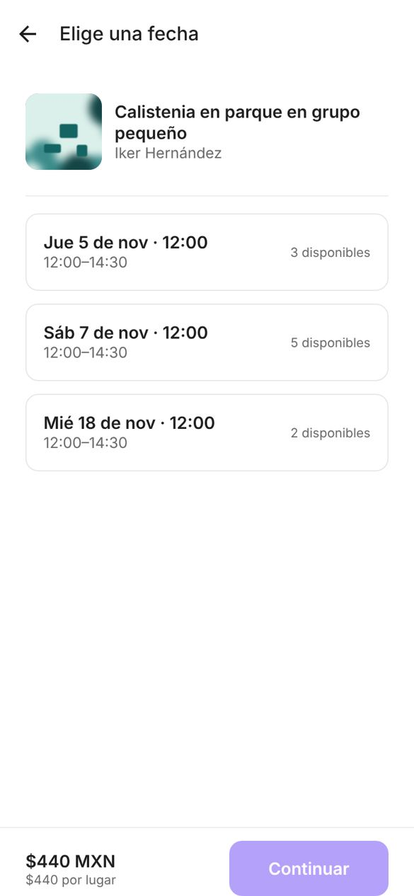
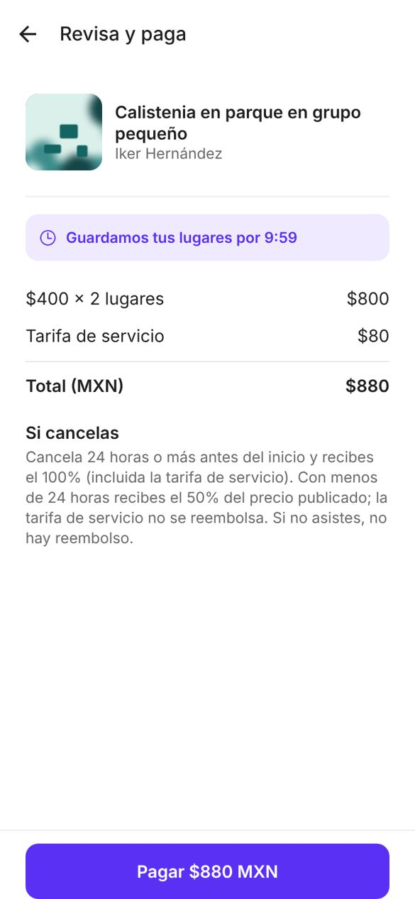
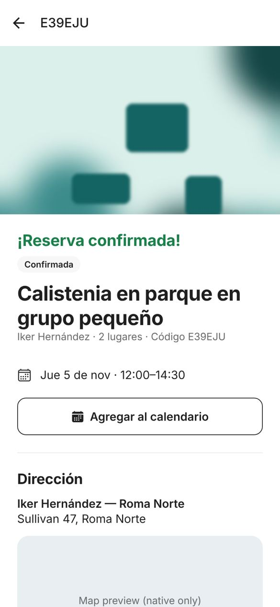
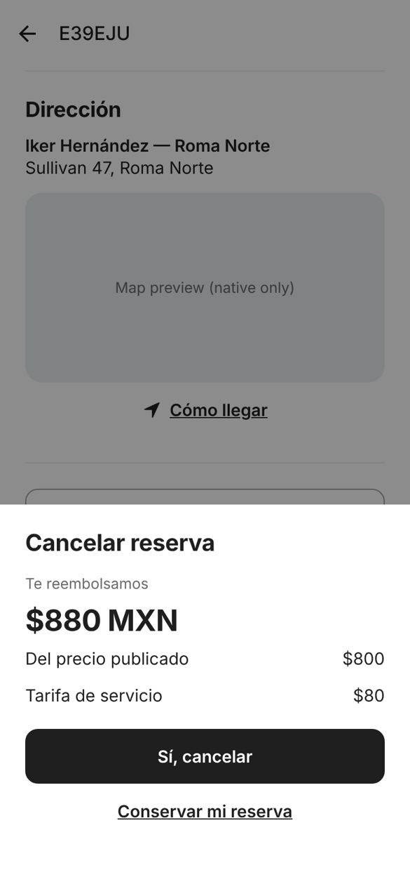
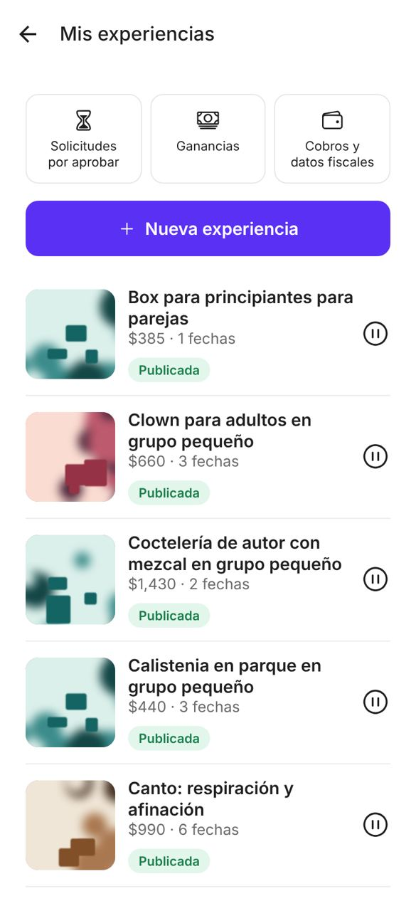
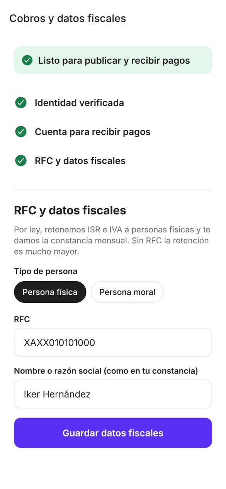

# Phase 2 — Booking, payments, cancellations, notifications, learner profile

Status: **built, tested, awaiting your approval.** Real money has not moved: Stripe is integrated and unit-tested against its API contract, but no Stripe account/keys exist yet, so every end-to-end run used the built-in test gateway (§6).

## 1. Decisions applied

| Decision | Applied as |
|---|---|
| Fee 10% | New `FeeConfig` row (1000 bps, IVA included) via migration; old 5% row kept for history. Existing bookings keep the fee they were charged. |
| Stripe Connect | Separate charges and transfers. Platform charges learner total, pays Stripe's fee, transfers the provider's share after class. Connected accounts use controller properties (Stripe-hosted KYC, weekly payouts). |
| RFC required | Tax profile (persona física/moral, RFC validated by format and length, legal name) is part of the go-live gate, with verified ID and a payout-enabled Stripe account. |
| Withholding | Mechanism built: `WithholdingConfig` (ISR/IVA bps, immutable rows) applied to individuals only, snapshotted per transfer, shown on the provider earnings screen. **Rates are 0 until your tax advisor sets them.** |
| Hosting | `railway.toml` + [deploy guide](../deploy.md) with the USD 45 hard limit. Not deployed (needs your account). |
| SMS | `TwilioSMSBackend` (plain HTTPS, no SDK). Switch with `SMS_BACKEND`; Bird/SNS are a ~25-line adapter each. |
| Admin 2FA | TOTP (authenticator app) for staff logins, replay-protected, enforced outside development. Enroll with `manage.py enable_admin_2fa`. |

## 2. What was built

**Booking and inventory**
- **Seat holds:** 10 minutes, one per learner per date, released immediately if the learner leaves checkout.
- **Overselling prevented:** every inventory change locks the session (or course group) row, and a database constraint backs it up. Tested with 10 parallel connections racing for 3 seats: exactly 3 win.
- **Course groups:** sold as one unit, taking a seat in every session of the group.
- **Slow 3-D Secure:** if a payment succeeds after the hold expired, the booking still confirms when seats remain. If the class sold out meanwhile, the learner is automatically refunded 100% and notified.
- **Approval:** experiences can require approval for learners whose conduct score is below a threshold. The card is only authorized; it's captured when the provider approves. The provider has 24 h (or until 1 h before class); otherwise it's auto-declined and the authorization released. Learners with no score yet are never held back.

**Payments** (`PaymentProvider` interface; Stripe adapter + test adapter)
- **Native payment sheet:** cards, Apple Pay and Google Pay; saved cards; 3-D Secure.
- **Webhooks:** signature-verified, stored once per event ID, then processed by the job queue. Duplicates are no-ops (tested by sending the same event 3 times).
- **No lost or doubled money moves:** refunds, transfers and authorization releases are written to the database first and executed by jobs after commit, each with an idempotency key. A crash can't lose or duplicate a payment.
- **Provider transfers:** released 48 h after the (first) session ends, with ISR/IVA withholding.
- **Exceptions put transfers on hold:** chargebacks, no-show disputes and missing payouts. Refunds after a payout reverse the transfer.

**Cancellations and refunds**
- **The learner sees the exact refund first.** The quote is signed and valid for 2 minutes. On confirm, the server recalculates and refuses with `quote_changed` if the window moved, so the learner never receives an amount different from the one shown.
- **Standard policy, exactly as you specified:**
  - 24 h or more before: 100% including the fee (the 24 h boundary is inclusive).
  - Under 24 h: 50% of the listed price, fee retained, rounded half up to the centavo. The provider keeps the other 50%.
  - No-show: 0%.
- **Snapshot at purchase:** the policy is copied onto the booking when it's paid, so later policy edits don't change it.
- **Provider cancellation:** everyone gets 100% back including the fee, and a penalty point is added. Three cancellations in 90 days auto-pause the provider's listings.
- **Audit:** every cancellation is logged with timestamp, actor, rule applied and amounts.

**Attendance:** providers mark present/absent from the session start until 48 h after it ends. A learner marked absent becomes a no-show (provider keeps 100%); the learner can dispute within 48 h, which opens an admin case and holds the transfer.

**Notifications:** push (Expo → APNs/FCM) and email, in the user's language, idempotent per event and channel.
- **Events:** booking confirmation (with `.ics` attached), new booking for the provider, approval request/decision, cancellations with refund amount, sold-out refund, payment failure, 24 h and 2 h reminders, payout sent, data export ready.
- **Preferences:** learners can turn off push, email or reminders. Money-related messages can't be turned off.

**Learner profile:**
- **Bookings:** upcoming/past lists; booking detail with exact address and map once confirmed, directions, add to calendar, and cancellation with the exact refund.
- **Account:** saved cards (view/remove), notification settings, data export (emailed signed link, 24 h), account deletion.
- **Deletion:** anonymizes the account, revokes tokens, and keeps only booking and payment records without identity. It's blocked while bookings or payouts are pending.
- **Feed:** your interests now rank first within each distance band (< 2 km, < 5 km, < 10 km); nothing is hidden.

**Provider tools:**
- **Setup:** payouts and tax setup (3-step checklist, Stripe-hosted onboarding).
- **Bookings:** approval requests, attendance roster with conduct score, languages and accessibility needs (only with the learner's explicit consent), and cancelling a date.
- **Money:** earnings showing gross, withholding and deposit.

**Admin:**
- **Records:** bookings with payments, refunds and the cancellation log.
- **Refunds and disputes:** a refund/dispute tool for any amount up to what remains, always audited; retry for failed refunds; hold/release for transfers.
- **Configuration:** withholding config, payment accounts, tax profiles (with a "validated" timestamp for checking the SAT constancia), webhook log, notification log.

## 3. Screens

Real renders (web preview at phone size, against the seeded API; photos are generated stand-ins because the sandbox can't reach photo hosts; maps render only on device).

| Choose date | Review and pay (hold timer, breakdown, policy) | Confirmed: address unlocked |
|---|---|---|
|  |  |  |

| Cancel: exact refund before confirming | My bookings | Provider tools |
|---|---|---|
|  |  |  |

| Attendance roster | Earnings | Payouts and RFC setup |
|---|---|---|
|  |  |  |

## 4. Verification

| Check | Result |
|---|---|
| Backend tests (real PostGIS) | **186 passed**. Phase 2 adds 74, covering all the mandatory areas: seat inventory (incl. a 10-thread race), booking, fee calculation, refunds, cancellations. Also: approval flow, idempotent webhooks, sold-out refund, transfers with withholding, reversal after payout, chargeback hold, attendance and disputes, reminders, Stripe adapter request parameters and webhook signatures (no network), data export, deletion, admin 2FA (RFC 6238 test vector, replay rejection) |
| Mobile | `tsc` clean, ESLint 0 errors, 15 unit tests, iOS + Android bundles build |
| End to end (browser preview) | Learner: feed → detail → Book → SMS login (code from server log) → pick date → 2 seats → review ($800 + $80 fee = $880) → pay (test gateway) → confirmed with address → cancellation quote ($880, fee included at > 24 h). Provider: login → tools → roster showing the learner → earnings showing the $800 transfer → payouts/RFC checklist complete. |
| Feed latency | p95 29 ms (200 experiences) after adding interest ranking |

**Bugs the tests and runs caught and I fixed in this phase:**
- stripe-python v16 objects are no longer dicts; webhook parsing would have crashed in production.
- The auth modal didn't close after login when the user started from an experience (Phase 1 regression, hidden because that test pushed a new screen on top).
- The RFC form showed empty fields for providers who already had one.
- Date options had no accessibility role.

**Not verified (needs your accounts):**
- Real Stripe charges, Apple Pay/Google Pay sheets and Connect onboarding.
- Real push delivery (needs an EAS project id).
- Twilio delivery.
- Docker image build and Railway deploy.

## 5. Assumptions (correct any)

1. **Cancelling a course** uses the first session's start time; once the course starts, it can't be cancelled through the app (admin can refund).
2. **Course transfer:** released 48 h after the first session ends. Once a course has started, the provider keeps it unless admin refunds.
3. **Max 6 seats** per booking.
4. **Providers can't cancel** a single session of a course; they cancel the whole group (everyone refunded).
5. **Withheld ISR/IVA** stays in the platform's Stripe balance until you pay SAT monthly; the monthly SAT filing and CFDI de retenciones are not automated (needs a PAC, see §7).
6. **Saved cards:** the Stripe ephemeral-key API version is set to `2020-08-27` (config `STRIPE_EPHEMERAL_KEY_API_VERSION`). Check it against the Stripe React Native docs when you create the account; if it's wrong, saved cards won't show but payment still works.

## 6. Running it without Stripe (development)

`PAYMENT_GATEWAY=fake` (default in development) replaces Stripe with an in-process gateway: the app shows a test-mode payment, the API simulates the signed webhook, and provider KYC completes instantly. The settings refuse to start with the fake gateway when `APP_ENV=production`. Everything else (holds, refunds, transfers, jobs) runs the same code as production.

## 7. Open decisions for you

1. **Withholding rates** for personas físicas (and any IVA treatment of the 10% fee): from your tax advisor. Until set, the platform withholds 0%. **This blocks launch, not development.**
2. **CFDI / SAT reporting:** monthly retention certificates and fee invoices need a PAC (e.g. Facturapi). Recommend adding in Phase 3 or right before launch.
3. **Stripe account:** create it under the operating entity (RFC placeholder today), enable Connect, Apple Pay domain/merchant ID. Steps in [deploy.md](../deploy.md).
4. **Conduct threshold default:** providers set it per experience; there's no platform default. Keep it that way?
5. **Penalty policy:** currently flag + auto-pause at 3 provider cancellations in 90 days, no money. Confirm.

## 8. Phase 3 preview

Two-way double-blind reviews (14-day window), conduct scores from provider ratings with appeals, booking-scoped messaging with contact-info detection and reports, online experiences behind the App Store decision.
