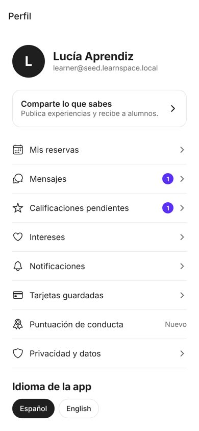
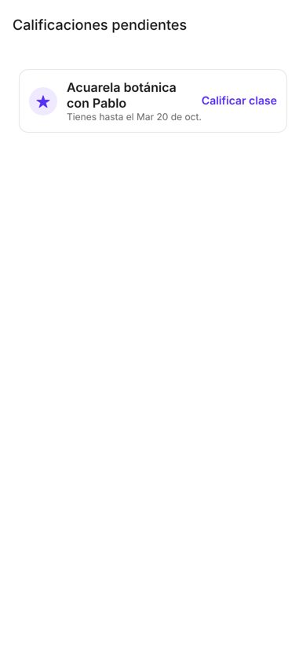
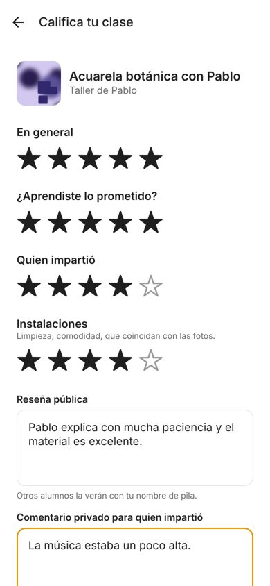
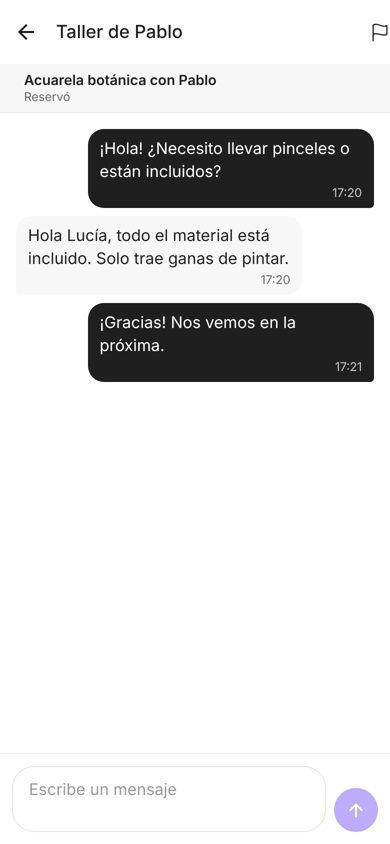
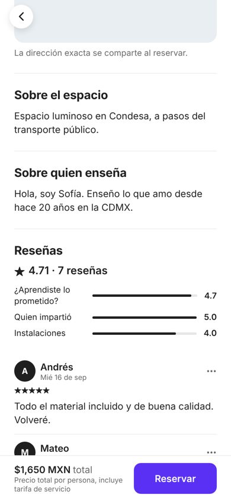
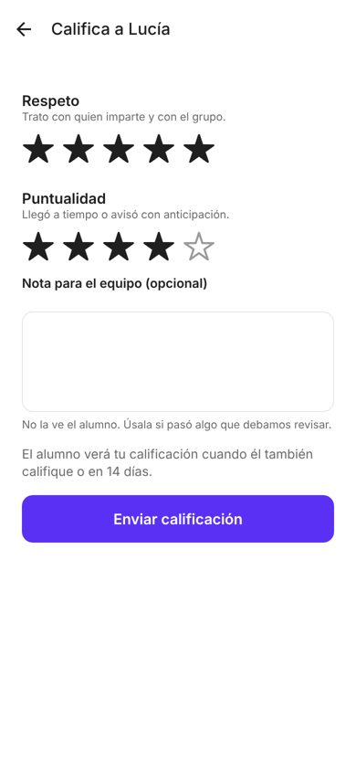
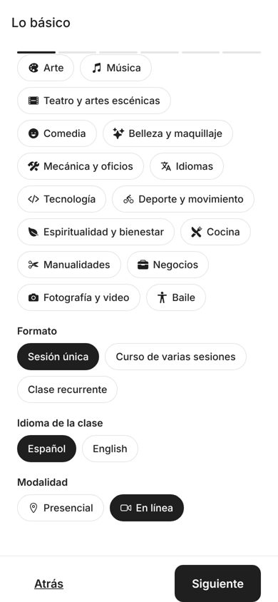
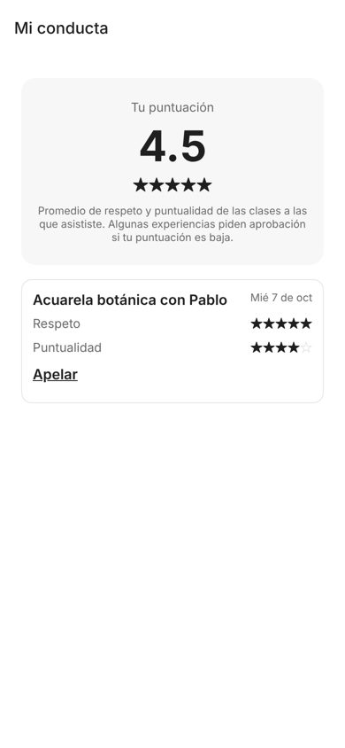
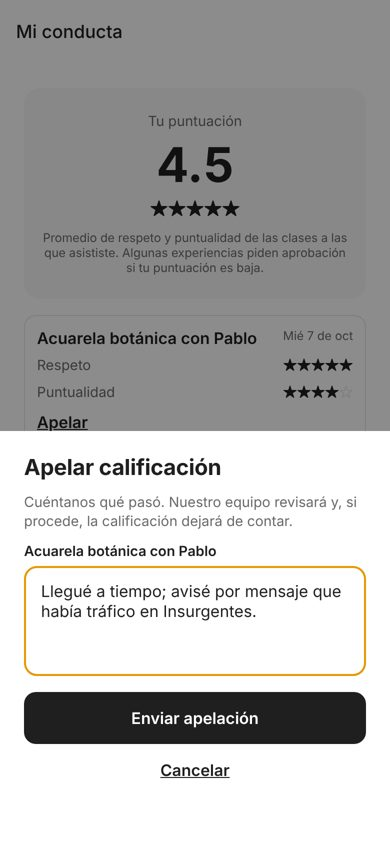

# Phase 3 — Reviews, conduct scores, messaging, online experiences

Status: **built, tested, awaiting your approval.** Payments remain in test mode (see [going-live.md](../going-live.md)).

## 1. What was built

**Two-way, double-blind reviews**
- **Window:** opens when the class ends and closes 14 days later. Both sides get a push/email prompt when it opens.
- **Learner rates:** overall, "did you learn what was promised", host, and space (in-person only). They can add a public text and a **private note only the host sees**.
- **Host rates the learner:** respect and punctuality, plus an optional note for the admin team that the learner never sees.
- **Double-blind:** nobody sees the other side's rating until both have submitted, or until the window closes (an hourly job reveals whatever exists). This prevents retaliation ratings.
- **Who can rate:** cancelled bookings can't be reviewed. A no-show can still be rated by the host but can't review the class.
- **Aggregates:** experience and host averages are recomputed from revealed, visible reviews only. Hiding a review removes it from the average.

**Conduct score and appeals**
- **Score:** the average of (respect + punctuality) / 2 over revealed ratings. It feeds the Phase 2 "approval below score X" option, which now has real data.
- **"Mi conducta" screen:** shows the score and each rating. One appeal per rating, with at least 20 characters of explanation.
- **Admin decision:** uphold, or overturn. Overturning excludes the rating from the score. Every decision is written to the audit log.

**Messaging**
- **One conversation per learner and experience.** Learners can ask before booking.
- **No cold messages:** hosts can only start a conversation with someone who booked.
- **Contact-info detection before booking:** phones (including spelled-out digits: "cinco cinco…"), emails (including "arroba … punto com"), links, CLABE/card numbers, and WhatsApp/Instagram/@handles.
- **What happens on detection:** the message is not blocked. The sender sees a warning explaining they lose protection (refunds, policy, support). If they send anyway, the message is flagged for the admin queue.
- **After booking:** detection is off, since sharing a phone number is normal then.
- **Inbox:** unread badges, push notifications that open the thread, and polling every 4 s while a thread is open. There are no websockets in the MVP (see §5).
- **Reports:** for experiences, reviews, messages and users. Users can only report what they can see. Duplicate open reports are merged.

**Online experiences, behind an App Store gate**
- **Hosts:** pick "En línea" in the wizard and paste an https link instead of choosing a space.
- **Learners:** see the link only after their booking is confirmed (booking detail with a "Join class" button, calendar file, 2 h reminder).
- **iOS:** the app sends `X-Client-Platform`. On iOS, online experiences are hidden from feed, map and detail, and seats can't be held for them. Android and web see them. The flag is `ONLINE_EXPERIENCES_ON_IOS=false`, and the decision is yours (§4).

**Admin**
- **Flag queue (Reports):** dismiss, hide the reported review/message, suspend the reported user.
- **Other screens:** reviews (hide/show), conduct appeals (overturn/uphold with a note), flagged messages, and read-only conversations, where every view is audited.

**Seed data:** 710 real double-blind reviews, so ratings now match reviews; before this phase they were random numbers. Test accounts are ready for every flow:
- **Lucía** (learner) has a class from yesterday to review and a conversation with Pablo.
- **Pablo** (host) has her to rate, plus one online experience.

## 2. Screens

Real renders: web preview at phone size against the seeded API. Photos are stand-ins.

| Profile (messages, pending ratings) | Pending ratings | Rate your class |
|---|---|---|
|  |  |  |

| Inbox | Conversation | Reviews on the experience |
|---|---|---|
|  |  |  |

| Host rates learner | Reviews received (with private note) | Wizard: online option |
|---|---|---|
|  |  |  |

| My conduct (after reveal) | Appeal |
|---|---|
|  |  |

## 3. Verification

| Check | Result |
|---|---|
| Backend tests (real PostGIS) | **234 passed** (Phase 3 adds 48). Covered: window open/close, double-blind reveal, one-sided reveal at day 14, facilities rule, aggregates, moderation hide, appeals (overturn/uphold/duplicate/unrevealed), detection (12 cases incl. false-positive checks), warning → acknowledged send, no warning after booking, provider can't cold-message, third parties can't read, suspended users can't send, reports (visibility, dedupe), iOS gate on feed/detail/holds, link only after booking, link in calendar file and reminder, admin flag-queue actions, seed consistency |
| Mobile | `tsc` clean, ESLint 0 errors, 18 unit tests, iOS + Android bundles build |
| End to end (browser) | Learner: profile badges → pending → review → inbox → reply → reviews on detail. Host: pending → rate learner → reveal → reviews received with private note → online in wizard. Learner: conduct 4.5 after reveal → appeal sheet. Feed via API: online experience visible for `web`, absent for `ios`. |

**Bugs caught and fixed in this phase:**
- **Conduct-rating route:** booking's `provider/bookings/<id>/<decision>` route swallowed it, so the endpoint returned 404.
- **Stale reveal status:** the response showed "not revealed" right after the reveal happened.
- **Detector:** false positives and misses (WhatsApp slang, an @handle misread as an email).

**Not verified:** the contact-info warning dialog on a real device. React Native Web doesn't render native alert buttons, so this path is covered by API tests only.

## 4. Decision for you: online experiences on iOS

Apple's rule 3.1.1 requires in-app purchase (30% commission, or 15% under the small-business program) for "digital content or services consumed in the app". Rule 3.1.3(d) exempts **"person-to-person services"** such as real-time one-on-one tutoring. In-person classes are clearly exempt under 3.1.3(e) (services consumed outside the app). Live **group** online classes are a grey area, and Apple has rejected marketplaces for this.

| Option | Pros | Cons |
|---|---|---|
| **A. Keep hidden on iOS (current)** | No review risk at launch; Android/web still sell online | iOS users don't see online classes |
| B. Show on iOS, pay outside the app (web link) | Full catalog | Likely rejection; anti-steering rules vary by country |
| C. Show on iOS with in-app purchase | Compliant | 15–30% to Apple on top of your 10%; second payment stack |

**Recommendation:** A for launch, then apply for the 3.1.3(d) exemption with a 1:1 live format if online demand appears. Switching is one environment variable.

## 5. Assumptions (correct any)

1. **Review window:** 14 days, counted from the end of the last session (courses are reviewed once, at the end).
2. **Public reviews:** show the first name only and no photo.
3. **Learners can't reply to reviews.** Hosts can't reply publicly yet (common follow-up).
4. **No-shows:** the host can rate the learner, but the learner can't review the class.
5. **Polling instead of websockets:** chat updates every 4 s while open, plus push. It's cheap on the USD 50 budget; websockets need Channels/Redis, which we excluded.
6. **Messages are kept** for moderation. On account deletion they stay with the sender anonymized, the same as bookings.

## 6. Open decisions

1. **iOS online experiences:** option A, B or C (§4).
2. **Public host replies to reviews:** now or later?
3. **Conduct threshold default:** stays off by default (decided in Phase 2). Confirm, now that scores exist.

## 7. Next

Phase 4 per the Phase 0 plan: Space Hosts (people who rent out spaces to instructors). Before real users, separately from that phase: switch to real Stripe/Twilio/EAS ([going-live.md](../going-live.md)), Sentry, and the "approve each new learner" [backlog](../backlog.md) item if you want it in.
