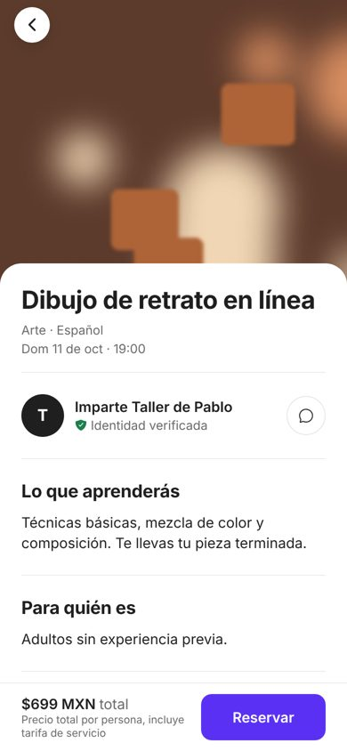
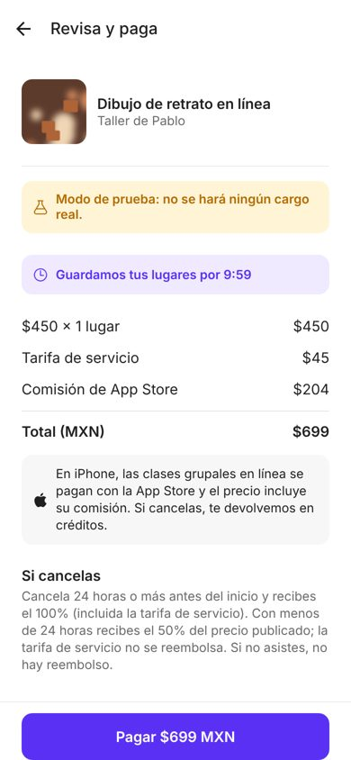
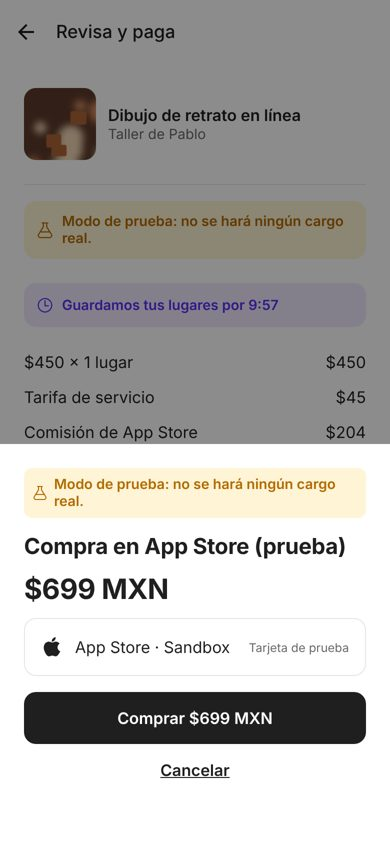
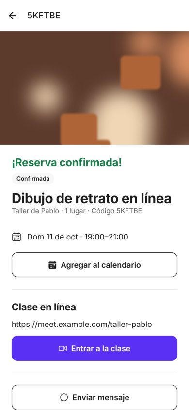
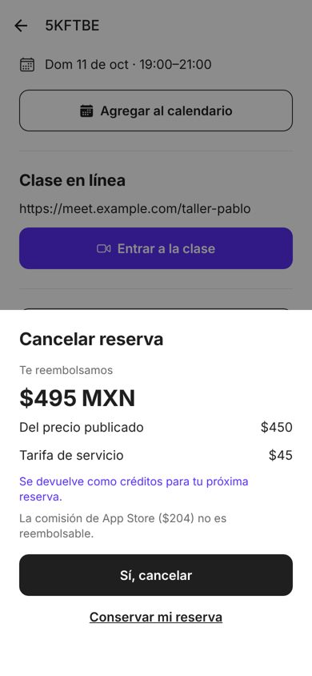
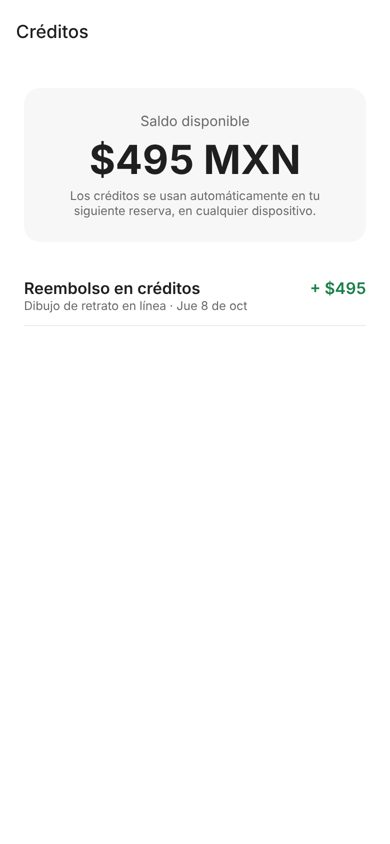

# Phase 4: Group online classes on iPhone (App Store) and pilot readiness

Status: **built, tested, awaiting your approval.** It runs in test mode, as Stripe did in Phase 2: there is no Apple account yet, so a stand-in "App Store (prueba)" sheet is used and the server simulates Apple's signed purchase.

Scope change recorded: Space Hosts (the original Phase 4) are deprioritized ([backlog](../backlog.md)).

## 1. Decisions applied (2026-10-08)

| Decision | Applied as |
|---|---|
| Online classes on iOS, even with Apple's commission (option C) | **Group online classes on iPhone are sold through In-App Purchase.** One-to-one online classes (capacity 1) and in-person classes keep using Stripe on every device (guidelines 3.1.3(d) and 3.1.3(e)). |
| Price on iPhone is higher | The iPhone price is the smallest App Store price point that, after Apple remits IVA and keeps 15%, leaves the same as a card sale. Example: the provider's $500 plus your $50 fee costs $550 on Android/web and **$749 on iPhone** ($199 surcharge). The provider receives the same either way. |
| Cancellations as credit | Only Apple can refund App Store purchases, so refunds come back as **in-app credit**. Credit pays any booking, on any device. |
| What credit covers | **Learner cancellation:** the same amount as on other devices, under the same policy. The App Store surcharge is not refunded; the app shows this before booking and when cancelling. **Provider cancellation, sold out, or a declined approval:** everything, surcharge included. |
| One-to-one exception | Capacity-1 online classes are paid by card on iPhone too (no Apple commission). |

## 2. What was built

**App Store purchases**
- **Payment channel:** decided on the server from the device (`X-Client-Platform`) and the experience: card or App Store. The app never chooses.
- **Products:** one consumable per price point, 70 in total by default (configurable). `manage.py iap_products` prints the list to create in App Store Connect.
- **Verification (StoreKit 2):** the iPhone sends Apple's signed transaction, and the server checks:
  - the certificate chain up to the pinned **Apple Root CA G3** and the ES256 signature;
  - the bundle id, environment (Sandbox allowed only outside production), product (price point) and price;
  - that the booking id travels as `appAccountToken`;
  - that the transaction hasn't already paid another booking (replay protection).
  - A retry with the same transaction is idempotent. The app finishes the transaction only after the server verifies it, so an interrupted purchase is replayed by iOS, never lost.
- **Apple refunds** (App Store Server Notifications V2, `REFUND`/`REVOKE`), signature-verified and processed once:
  - **Before the class:** the booking is cancelled, the seat is released and the provider is notified. Only the part paid with credit comes back as credit, since Apple already refunded the rest.
  - **After the class:** the provider's payout is held and an admin case opens, the same as a card chargeback.
- **Approval-required experiences:** Apple can't authorize and capture later, so iPhone bookings that need approval are charged immediately. If the provider declines or doesn't answer, everything comes back as credit.
- **Provider payouts** for App Store bookings: the same amount, 48 h after class, sent from the platform's Stripe balance. Apple pays about 33 days after month end, so the platform fronts it ([going-live.md](../going-live.md)).

**Credits**
- **Ledger:** append-only, with locking so two checkouts can't spend the same balance.
- **Checkout:** credit is applied automatically on any device.
  - **Card:** the remainder goes to the card, respecting Stripe's $10 minimum.
  - **App Store:** the remainder lands on a price point (e.g. $749 with $200 credit → pay $549 on the App Store).
  - **Fully covered:** the booking is confirmed without any processor.
- **Refunds:** go back to the card first, then to credit. The cancel sheet shows the split ("$350 a tu tarjeta y $200 en créditos").
- **Abandoned or failed checkouts** return their reserved credit when they expire.
- **Admin:** credit ledger with manual adjustments (audited).

**App**
- **iPhone price** on the detail and booking screens, with an "App Store commission" line and a short explanation.
- **Purchase:** a test App Store sheet in test mode; a real StoreKit purchase (`expo-iap`) once Apple is set up.
- **Credits:** applied at checkout and shown on the booking, plus a "Créditos" screen with balance and history.
- **Cancellation:** the sheet states credit vs card and that the surcharge isn't refundable.
- **Wizard:** shows the host what iPhone learners will pay.

**Pilot readiness**
- **Sentry in the app:** off until `EXPO_PUBLIC_SENTRY_DSN` is set, and without personal data. The backend already had Sentry.
- **`eas.json`:** `development`, `pilot` (TestFlight + Google Play internal testing) and `production` profiles.
- **Docs and settings:** `.env.example` with the new variables; [going-live.md](../going-live.md) has a 9-step App Store checklist.

## 3. Screens (iPhone flow, simulated in the browser preview)

| iPhone price on the detail | Review: App Store commission line | App Store sheet (test) |
|---|---|---|
|  |  |  |

| Confirmed with class link | Cancel: refund as credit | Credit balance |
|---|---|---|
|  |  |  |

## 4. Verification

| Check | Result |
|---|---|
| Backend tests | **259 passed** (+24) |
| What the new tests cover | Price-point math; channel per device/experience; 1:1 exception; credit refunds without surcharge; provider cancellation with surcharge; credit paying in full or in part (card and App Store); Stripe minimum; abandoned checkout restoring credit; approval charged then declined as credit; signed-transaction acceptance, idempotent retry and rejection (wrong product/token/bundle/price, forged signature, untrusted root, replay); Apple refunds before and after class (processed once, no double refund); payouts without a Stripe charge |
| Mobile | `tsc` clean against the real `expo-iap` and Sentry types; ESLint 0 errors; 18 unit tests; iOS + Android bundles build |
| End to end (browser preview, iOS header) | Online class shows $699 ($450 + $45 + $204) → review with commission line → App Store test sheet → confirmed with class link → cancel shows $495 as credit and the $204 surcharge kept → credit balance $495 |

**Bugs found and fixed:**
- **Credit refunds didn't appear locally:** they waited for a background worker. Credit is our own ledger, so it is now applied immediately.
- **Dev CORS:** the web preview didn't allow the `X-Client-Platform` header. Dev only; the native app doesn't use CORS.
- **Bundle id mismatch:** the backend default (`mx.learnspace.app`) didn't match the app's (`com.learnspace.app`).

**Not verified (needs your accounts):**
- A real StoreKit purchase and Apple's server notifications (needs Apple Developer + App Store Connect).
- A real build on a device.
- A Sentry project.

## 5. Assumptions (correct any)

1. **Small Business Program:** 15% commission (under USD 1M/yr in App Store sales).
2. **IVA:** Apple remits 16% IVA out of the customer price. Your tax advisor should confirm how this affects your IVA and the provider's.
3. **Price points:** whole pesos ending in 9, from $49 to $9,999. If App Store Connect doesn't offer an exact point, set `IAP_PRICE_POINTS_MXN` to the ones you create.
4. **Credit:** doesn't expire and can't be withdrawn as cash; it's for bookings only. This should go in the terms of service.
5. **Multiple seats** of a group online class on iPhone also go through the App Store.
6. **Bundle id:** `com.learnspace.app` is a placeholder. It must be final before the first App Store upload.

## 6. Your checklist to start the pilot

In order. Each item is an account only you can open, and I guide you through each one.

| # | What | Cost | Unlocks |
|---|---|---|---|
| 1 | **Railway** account + "Deploy from GitHub" ([deploy.md](../deploy.md)) | ~USD 5–20/mo, hard cap USD 45 | Backend online 24/7 (staging, test mode) |
| 2 | **Expo** account (free) | Free | Building the app in the cloud (`eas build --profile pilot`) |
| 3 | **Apple Developer** (company) | USD 99/yr | TestFlight for iPhone testers, Sign in with Apple, App Store purchases |
| 4 | **Google Play Console** | USD 25 once | Internal testing for Android testers |
| 5 | **Sentry** (free plan) | Free | Crash reports from testers |
| Later | Stripe, Twilio, App Store products | Per use | Real money ([going-live.md](../going-live.md)) |

With 1–4 the pilot runs in test mode with real people: real bookings, messages and reviews, no real charges.

## 7. Open decisions

1. **Final brand / bundle id before the first App Store upload.** It can't be changed afterwards.
2. **Credit terms:** no expiry and not withdrawable (my default), or an expiry (e.g. 12 months)?
3. **Who you want as pilot testers** (number of hosts and learners), to size the plan and the onboarding.
